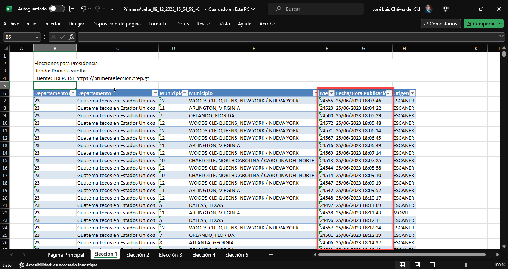

# WebPx.Trep.Analizer
Sistema para lectura y transformación de los archivos del TREP para permitir a cualquier persona poder obtener los resultados sin intervención humana.

Autor: José Luis Chávez del Cid

Licencia: MIT

Fecha Publicación Inicial: 9/Diciembre/2023

## Definiciones

Nombre | Descripción
-|-
TSE|Tribunal Supremo Electoral
TREP|Transmisión de REsultados Preliminares

## Descargo de responsabilidades
Esta aplicación fue desarrollada para funcionar contra los datos disponibles en los servidores del TREP. No se incluye el archivo 'GTM-pruebas.zip' dentro de los fuentes, para que este sea descargado directamente desde el TREP.

Todos los datos contenidos en los archivos 'GTM-pruebas.zip' desde trep.gt son responsabilidad del Tribunal Supremo Electoral y sus proveedores de la aplicación y del servicio.

Por ningun motivo nos hacemos responsables de los datos origen, ni de cualquier cambio que pueda suceder dentro de estos, o del uso que se le de a esta aplicación y los archivos generados.

Las horas almacenadas en los archivos originales del TREP NO cuentan con zona horaria, por lo que se puede asumir que todos estan configurados para la zona horaria de "America Central/Guatemala" como se define en los estandares internacionales de zonas horarias, que es equivalente a -6 GMT (Tiempo del Meridiano de Greenwich).

## Soporte para Elecciones Generales Guatemala 2023
La aplicación soporta extraer los datos para ambas vueltas: "Primera Vuelta" y "Segunda Vuelta". El archivo 'GTM-pruebas.zip' es un archivo que contiene todos los datos en formato CSV, sin ningun formato visual, o facilidad de entenderlo o preocesarlo para cualquier usuario, para lo cual la presente herramienta permite descargar, extraer y transformar estos a algo más amigable para cualquier persona.
### Primera Vuelta
Esta incluye las opciones para acceder a la información de las elecciones para
- Presidente y Vicepresidente
- Diputados Listado Nacional
- Diputados Distritales
- Corporación Municipal
- Diputados Parlamento Centroamericano

### Segunda Vuelta
En este caso las opciones para acceder a la información se limitan a su naturaleza, ya que los archivos del trep cuentan solo con estos datos
- Presidente y Vicepresidente

## Funcionalidad
La aplicación inicialmente permite las siguientes opciones

### Inicio de la aplicación
Al iniciar la aplicación esta se configura para cual de las vueltas electorales debe procesar los datos

Opción | Descripción
-|-
Extraer fecha y hora de publicación de actas | Genera Archivo de Excel con datos de la mesa y la fecha/hora de publicación

### Extraer fecha y hora de publicación de actas
Esta opción  permite generar un archivo de Microsoft Excel con una hoja indice, y las hojas correspondientes a las elecciones seleccionadas, dentro de las que se esperan que esten disponibles para la vuelta seleccionada. En el caso de Diputados Distritales y Corporación Municipal el origen de los datos contiene archivos para cada departamento y municipio respectivamente, para lo cual se condensan en una sola hoja en el archivo de Microsoft Excel.  En el nombre del Departamento el #23 corresponde a las votaciones en Estados Unidos, el cual solo estará disponible en las votaciones ppara *Presidente y Vicepresidente*.

Cada hoja de las elecciones contiene los siguientes datos:

Columna | Descripción
-|-
Departamento ID|Código de Identificación del Departamento
Departamento|Nombre del Deparamento
Municipio ID|Código de Identificación del Municipio
Municipio|Nombre del Municipio
Mesa|Número de Mesa
Fecha/Hora Publicacion|Fecha y Hora de la Publicación del Acta No. 4 en el TREP
Origen|Como se digitalizó el acta

Al ingresar a la opcióm de acuerdo a si es primera vuelta le permitirá elegir si quiere extraer todas las votaciones/elecciones

Una vez las opciones estan listas el sitema generará el archivo de salida en formato excel (.xlsx)

Al abrir el archivo en excel se podrán ver datos de la mesa, la mesa y las fechas. Según el orden de las mesas en los archivos originales.

NOTA: En esta imagen los datos ya han sido ordenados en orden ascendente, comprobando que las fechas y horas inician a partit de las 18:03 horas.

### Versiones
No | Fecha | Descripción
-|-|-
1.0.0|9/Dic/2023|Transformación de los datos de las fechas de publicación de actas
